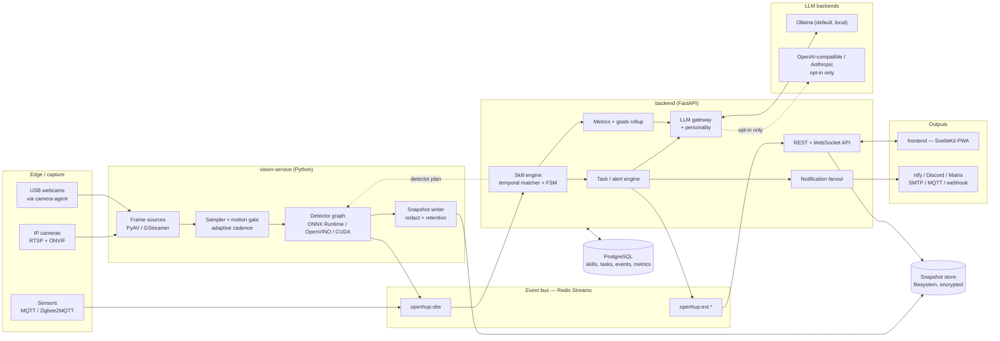
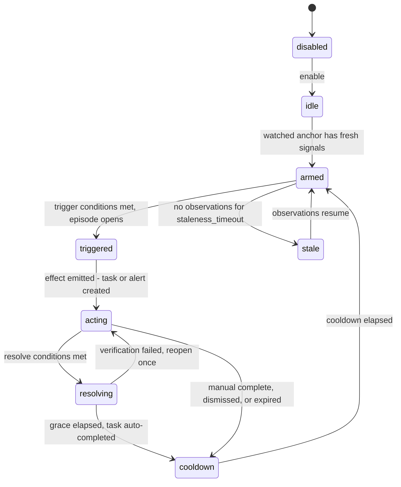

# OpenHup — Architecture

> Status: the design is implemented and tested for schemas, the skill engine, the backend, and the
> vision pipeline. The frontend is a scaffold and a few detectors and integrations remain.
> Audience: an experienced Linux/DevOps developer who wants to run and extend this.

OpenHup is a self-hosted, local-first home assistant that watches spaces with cameras
(and optional sensors), turns what it sees into **tasks**, **alerts**, and **habit metrics**,
and talks to you with a configurable personality — from *Kind Coach* to *Chaos Goblin*.

Name note: `openhup` is used throughout as the package/repo name. If a rename is wanted later,
`chorewatch` and `poltergeist` are both clear, descriptive, and free of trademark collision.
All identifiers are namespaced under a single `openhup` string constant to make renaming cheap.

---

## 1. Design principles

1. **Local-first by default.** Nothing leaves the LAN unless the operator explicitly opts in.
   The default LLM is a local Ollama model. Remote LLM use requires a config flag *and* a
   redaction profile.
2. **Degrade, never break.** If the LLM is down, tasks still get created with deterministic
   template text. If the vision service dies, the API and task list keep working.
3. **Separate seeing from deciding.** The vision service only reports *observations*
   ("clutter_level=0.72 on kitchen.counter"). All policy — thresholds, timing, whether that
   deserves a task — lives in the skill engine. You can swap detectors without touching skills.
4. **Anti-nag as a feature.** Hysteresis, cooldowns, quiet hours, and per-day caps are
   first-class schema fields, not afterthoughts. A tool that nags gets uninstalled.
5. **Everything has a picture.** Every task and alert carries a snapshot reference. Visual
   anchoring is the core UX affordance for the ADHD/neurodivergent use case.
6. **Safety outranks comedy.** High-urgency alerts bypass the personality layer entirely and
   are phrased plainly.

---

## 2. Component map



### Service boundaries

| Service | Language | Responsibility | Scales by | Talks to |
|---|---|---|---|---|
| `backend` | Python / FastAPI | REST + WS API, skill engine, task/alert/metric state, LLM gateway, notifications | 1 API process + 1 engine worker (engine is singleton-per-deployment, leader-locked in Redis) | Postgres, Redis, LLM, snapshot store |
| `vision-service` | Python | decode frames, run detectors, emit observations, write snapshots | one instance per capture host / per GPU | Redis, snapshot store, backend (plan pull) |
| `camera-agent` | Python (tiny) | push frames from hosts that own a USB/CSI camera | one per device | vision-service or Redis |
| `frontend` | SvelteKit + TS | UI | static, served by backend or Caddy | backend only |
| `packages/openhup-schemas` | Pydantic v2 → JSON Schema → TS | single source of truth for wire types | n/a | build-time |

The **engine is a separate process from the API** even though both live in `backend/`. The API
must stay responsive; the engine does timer ticks, LLM calls, and notification I/O. Same codebase,
different entrypoint (`openhup.api:app` vs `python -m openhup.engine`).

---

## 3. Data flow, end to end

Worked example — *kitchen counter is a disaster*:

1. `vision-service` pulls the kitchen camera's RTSP **substream** at 640×360. A motion gate
   (frame-difference inside the ROI polygon) suppresses ~95% of frames on an idle kitchen.
2. Every 30 s (adaptive: 5 s while motion is active, 120 s while idle for >10 min) it runs the
   detector plan for anchor `kitchen.counter`: `clutter_score` + `object_inventory`.
3. It emits one **Observation** to `openhup:obs` and writes a snapshot to the blob store with a
   TTL derived from the strictest retention policy of the skills that requested it.
4. The **skill engine** consumes the stream (Redis consumer group `skill-engine`), appends signal
   values to a per-`(anchor, signal)` ring buffer, and re-evaluates every skill instance watching
   that anchor. A 1 Hz timer tick also fires so `for: 15m` and `absent_for: 4h` operators can
   trigger without new data.
5. `clutter_level >= 0.6` sustained 15 min → the skill instance FSM moves `armed → triggered`,
   opening an **episode** (a ULID). All effects are idempotent on
   `(skill_id, anchor_id, episode_id)`, so a redelivered observation cannot create a second task.
6. The **task engine** creates a task. Because the skill uses `mode: single_task_focus`, it asks
   the LLM for a 3-step micro-ladder and surfaces **only step 1**.
7. The **LLM gateway** renders the task title through the `chaos_goblin` personality, runs it
   through the boundary filter, and falls back to a deterministic template on any failure.
8. Notification fanout pushes to ntfy; the WS hub pushes `task.created` to open browsers.
9. Later, `clutter_level <= 0.25` sustained 2 min → the FSM moves `triggered → resolving → cooldown`,
   the task auto-completes with a "after" snapshot, and the metrics rollup extends the
   `kitchen.counter` clean streak.

Delivery semantics: at-least-once on the bus, idempotent effects in the engine, so the
observable behaviour is effectively-once.

---

## 4. Core object model

Six nouns. Everything else hangs off these.

```
Camera        a video source (RTSP URL, credentials, capabilities)
Anchor        a stable, named region of interest on a camera — "kitchen.counter"
              (polygon + optional baseline "clean" reference image). Tasks resolve against
              anchors, not cameras, so a camera can be re-aimed without orphaning history.
Detector      a named vision capability that emits typed signals for an anchor
Skill         user intent, compiled: watch → signals → conditions → effect → resolve
Effect        Task | Alert | Metric  (what a triggered skill produces)
Episode       one trigger→resolve cycle of one skill instance; the idempotency key
```

### Observation (vision → bus)

```json
{
  "schema": "openhup.observation/v1",
  "id": "01K3XQ8V4W7YB2M9C6NZ0PRSTA",
  "ts": "2026-08-17T12:34:56.789Z",
  "source": { "camera_id": "kitchen", "anchor_id": "kitchen.counter", "frame_seq": 918273 },
  "detector": { "name": "clutter_score", "version": "clip-vit-b32-int8@1.2", "backend": "onnxruntime-openvino" },
  "signals": [
    { "key": "clutter_level", "kind": "scalar",  "value": 0.72, "confidence": 0.81 },
    { "key": "object_count",  "kind": "count",   "value": 11 },
    { "key": "objects",       "kind": "set",     "value": ["cup", "plate", "cereal box"] },
    { "key": "burner_state",  "kind": "enum",    "value": "on", "confidence": 0.94 }
  ],
  "media": { "snapshot_ref": "snap://2026/08/17/kitchen/01K3XQ8V.jpg", "ttl_s": 604800 },
  "cost_ms": 42
}
```

Signal kinds: `scalar` (0..1 or unbounded float), `count`, `boolean`, `enum`, `set`, `bbox_list`.
Adding a detector means declaring which keys/kinds it emits — the UI's skill builder reads that
registry from `GET /api/v1/detectors`, so new detectors become selectable without frontend changes.

---

## 5. Skill schema

Skills are YAML (or JSON via API) and validated against a Pydantic model. Natural language is a
*front door*: `POST /api/v1/skills/parse` turns "remind me when the trash is full" into this
structure, shows it to the user for confirmation, and never auto-arms a skill the user hasn't seen.

```yaml
id: kitchen-clutter-buster
version: 1
enabled: true
description: "Keep the kitchen counter clear during waking hours."

watch:
  - anchor: kitchen.counter

signals:
  - id: clutter
    detector: clutter_score
    signal: clutter_level
    params:
      reference: baseline          # compare against the anchor's stored "clean" image
      sensitivity: 0.5             # 0..1, maps to detector-internal scaling

conditions:                        # trigger condition (boolean tree)
  all:
    - { signal: clutter, op: gte, value: 0.6, for: 15m }
    - { time_window: { between: ["07:00", "22:00"], tz: local } }

effect:
  type: task
  mode: single_task_focus          # single_task_focus | backlog
  title_hint: "clear the kitchen counter"
  micro_steps: auto:3              # auto:N | none | explicit list
  urgency: low
  personality: chaos_goblin        # overrides the global default

resolve:
  conditions:
    all:
      - { signal: clutter, op: lte, value: 0.25, for: 2m }   # note: 0.25 < 0.6 → hysteresis
  grace: 5m                        # keep the task visible briefly so the win is felt
  verify_on_manual_complete: true  # request a fresh observation; reopen if still cluttered

limits:
  cooldown: 45m                    # after resolve, don't re-trigger for this long
  max_per_day: 4
  quiet_hours: { between: ["22:00", "07:00"] }

snapshot:
  attach: true
  retention: 7d
  redact: [faces]
```

### Operators

| Operator | Meaning |
|---|---|
| `op: gte/lte/gt/lt/eq/neq` | scalar / count comparison |
| `op: contains / not_contains` | for `set` signals ("no trash can visible") |
| `op: changed_to` | enum transition (`burner_state → on`) |
| `for: <dur>` | condition must hold continuously |
| `within: <dur>` | condition must occur at least once in the trailing window |
| `absent_for: <dur>` | *no* observation satisfying it in the window (covers missing data) |
| `count_over: {window, n}` | N occurrences in a window ("bowl empty 3× today") |
| `rate: {window, per}` | derived rate, used mostly by metric skills |

`for`, `absent_for`, and `count_over` require the 1 Hz timer tick, because they can become true
when *nothing arrives*. This is the single most common bug in naive rule engines; it's handled by
evaluating every armed skill instance on both events and ticks.

### Skill instance FSM



`stale` matters operationally: a dead camera should raise a *system* notice, not silently stop
producing tasks. Silent failure is worse than a false positive here.

---

## 6. Vision service design

```
sources/         RTSPSource (PyAV), USBSource (OpenCV/GStreamer), AgentSource (HTTP push), FrigateSource (MQTT)
pipeline/        Sampler → MotionGate → ROICrop → DetectorGraph → ObservationEmitter → SnapshotWriter
detectors/       ObjectInventory, ClutterScore, ZeroShotState, PresenceAbsence, PersonFall, DoorState, ScreenOn
models/          registry.yaml (name, url, sha256, license, input shape, backends)
```

**Inference backend:** ONNX Runtime, with the execution provider chosen at startup —
`CPUExecutionProvider`, `OpenVINOExecutionProvider` (Intel iGPU / N100 class),
`CUDAExecutionProvider`, or `TensorrtExecutionProvider`. One code path, four hardware tiers.

**Default models (all permissively licensed):**

| Detector | Model | License | Notes |
|---|---|---|---|
| `object_inventory` | RT-DETR / D-FINE or YOLOX-s (ONNX) | Apache-2.0 | closed-set COCO nouns; fast |
| `zero_shot_state` | CLIP ViT-B/32 (ONNX, int8) | MIT | "clean counter" vs "cluttered counter"; also "burner on/off" |
| `open_vocab_detect` | YOLO-World / OWLv2 (opt-in) | Apache-2.0 / Apache-2.0 | arbitrary nouns: "dish rack", "pet bowl" |
| `pose_fall` | RTMPose / MoveNet (opt-in) | Apache-2.0 | fall detection |

> License caution: **Ultralytics YOLOv8/v11 is AGPL-3.0.** It is supported as an opt-in backend
> but is *not* the default, and no Ultralytics weights are vendored. Weights are never committed —
> `scripts/fetch_models.py` downloads and sha256-verifies them from `models/registry.yaml`.

**Clutter is measured three ways and fused**, because no single method is reliable:

1. **Baseline diff** — embedding distance (CLIP) plus structural diff against the anchor's stored
   "clean" reference. Robust to lighting via embedding space; the pixel diff catches large objects.
2. **Object density** — count and area fraction of movable COCO classes inside the ROI polygon.
3. **Zero-shot semantic score** — CLIP text-probe pair `["a tidy kitchen counter", "a cluttered
   kitchen counter covered in stuff"]`.

Fused with configurable weights per anchor; `sensitivity` in the skill remaps the output curve.
Every fused score ships its three components in the observation, so the UI can show *why* and the
user can calibrate against real footage.

**Detector plan pull.** The service does not decide what to run. It calls
`GET /api/v1/vision/plan` (and subscribes to `openhup:cmd.vision` for invalidation) and receives
per-anchor detector schedules derived from currently-enabled skills. Disable every skill on an
anchor and its detectors stop consuming CPU.

**Backpressure:** frames are dropped, never queued. A late frame is worthless; a growing queue is
an outage. Queue depth and drop rate are exported as metrics.

---

## 7. Skill engine internals

```
skills/
  schema.py        Pydantic models (Skill, Condition, Effect, Limits, ResolveSpec)
  compile.py       Skill YAML → CompiledSkill (flattened predicate tree + required signals)
  window.py        per-(anchor, signal) ring buffers with time-based eviction
  operators.py     for / within / absent_for / count_over / rate / changed_to
  evaluate.py      pure function: (CompiledSkill, WindowView, now) → Verdict
  engine.py        consumer loop + 1 Hz tick + FSM transitions + effect dispatch
  parse.py         natural language → draft Skill via LLM + strict schema validation
  simulate.py      replay stored observations against a draft skill (dry run)
```

`evaluate.py` is deliberately **pure** — no I/O, no clock reads, `now` is a parameter. That makes
the interesting logic unit-testable with synthetic signal histories, which is where the tests go.

`simulate.py` is a headline feature, not a nicety: before arming a skill, replay it against the
last N days of stored observations and show "this would have fired 14 times last week" — the fastest
possible cure for a badly-tuned threshold.

---

## 8. Task, alert, and metric engines

### Task lifecycle

```
proposed → open → in_progress → resolved_auto | resolved_manual | dismissed | expired
                ↘ snoozed ↗
```

- `proposed` exists for skills in review mode (`require_confirmation: true`), where OpenHup asks
  before adding to your list.
- Auto-resolution requires the skill's `resolve` condition to hold for its duration; a single
  clean frame is not enough (someone walking past the camera should not close a task).
- Manual completion with `verify_on_manual_complete: true` requests a fresh observation. If the
  anchor is still cluttered the task reopens **once**, with gentle phrasing, and then trusts the
  human. Arguing with the user twice is a bug.
- Every task row stores: `skill_id`, `anchor_id`, `episode_id`, `before_snapshot`,
  `after_snapshot`, `micro_step_index`, `urgency`, `text`, `text_source` (`llm` | `template`).

### Micro-task ladder (the ADHD path)

A `single_task_focus` skill never shows more than one open task per anchor. `micro_steps: auto:3`
splits the anchor into an ordered ladder, by one of two strategies:

- **Spatial** — subdivide the ROI polygon into N sub-regions ordered by clutter density:
  "just the left third of the shelf." Fully deterministic, no LLM needed.
- **Semantic** — LLM proposes steps from the object inventory: "put the three cups in the sink."

Step advance is driven by the clutter delta in the relevant sub-region, so progress is *observed*,
not self-reported. If a step's region clears, the next step appears. Partial credit is permanent:
completing step 1 of 3 is logged as a win even if the session stops there.

### Metrics and goals

Rollups are computed by a worker into `metric_points` (hypertable-friendly; plain Postgres is fine,
TimescaleDB optional):

| Metric | Derivation |
|---|---|
| `clean_streak_hours` | time since last trigger of a clutter skill on an anchor |
| `trash_cycles_per_week` | count of `trash_full → trash_empty` episodes |
| `tv_on_minutes_per_day` | integral of `screen_on` boolean per day (from `ScreenOn` detector) |
| `cook_sessions_per_week` | episodes of `stove_active` lasting > 8 min |
| `task_completion_rate` | resolved / created, windowed |
| `nag_index` | notifications sent per completed task — an anti-metric; if it climbs, thresholds are wrong |

Goals are a thin layer: `{metric, target, direction, window}` → progress and trend, feeding the
weekly coaching summary. "Cook more" = `cook_sessions_per_week >= 4, direction: up`.

---

## 9. LLM and personality layer

### Provider abstraction

```python
class LLMProvider(Protocol):
    async def complete(self, msgs: list[Message], *, json_schema: dict | None = None) -> str: ...
    async def describe_image(self, image: bytes, prompt: str) -> str: ...
    capabilities: ProviderCaps   # vision?, json_mode?, context, local?
```

Implementations: `ollama` (default), `openai_compatible` (llama.cpp server, vLLM, LM Studio,
OpenRouter), `anthropic`, `echo` (deterministic, used by tests and by `--offline`).

Structured output (skill parsing) uses JSON-schema-constrained generation where the backend
supports it, otherwise a validate→repair loop capped at 2 retries, then hard failure into the
"couldn't parse, here's a form instead" UI path. An LLM is never trusted to produce a valid skill.

Recommended local models: `qwen2.5:7b-instruct` or `llama3.1:8b` for text (skill parsing and
phrasing need instruction-following, not brilliance); `qwen2.5-vl:7b` if you enable
LLM scene descriptions. 8 GB VRAM or ~16 GB RAM for CPU inference.

### Personality file format

```yaml
id: chaos_goblin
display_name: "Chaos Goblin"
intensity: 4                 # 1 gentle … 5 unhinged, user-adjustable slider
tone: [gleeful, absurd, conspiratorial]
vocabulary:
  flavor: ["forbidden", "artifact", "lair", "gremlin"]
  avoid: ["lazy", "disgusting", "pathetic", "again"]
boundaries:
  never:
    - shame_language
    - body_or_appearance_comments
    - mental_health_diagnosis
    - strong_profanity
    - comparisons_to_other_people
  max_words: 30
  emoji: allowed
templates:
  task:   "The counter has grown a new civilization. Evict {object_hint}. That's all. Go."
  alert:  "{plain_text}"           # alerts stay factual even here
  weekly: "..."
fallback_style: neutral            # used when the LLM is unavailable
```

Ships with `kind_coach`, `deadpan_butler`, `chaos_goblin`, `drill_sergeant_lite`, and `brief`
(zero personality, template-only, no LLM calls at all).

### Safety rules — enforced in code, not in prompts

1. `urgency >= high` → **personality bypassed**. Safety alerts are plain declaratives:
   "Front-left burner has been on for 12 minutes. No one has been in the kitchen for 9 minutes."
2. A post-generation filter checks output against the `boundaries.never` list (deny-list regex +
   an optional cheap LLM self-check). On failure it falls back to the neutral template rather
   than retrying — comedy is not worth a second round trip.
3. Roast intensity requires explicit opt-in and is capped by a global
   `humor_ceiling` in `config.yaml`, so a household member can't be raised past what the
   operator allows.
4. Never reference the person's body, diagnoses, or history of failure. Streak language is
   framed forward ("next win") not backward ("you broke a 9-day streak").
5. No task text ever includes a count of past unfinished tasks. Backlog shame is the failure
   mode that kills this category of tool.

### Prompt surfaces

| Surface | Input | Output | Constraint |
|---|---|---|---|
| skill parse | user sentence + anchor list + detector registry | draft Skill JSON | JSON schema, then Pydantic |
| task phrasing | title_hint, object inventory, personality, urgency | ≤ 30 words | filtered, template fallback |
| micro-step split | object inventory, N | ordered step list | ≤ 12 words/step |
| alert phrasing | condition facts, urgency | ≤ 25 words | bypassed if urgency ≥ high |
| weekly coaching | metric deltas, goals, streaks | short report | no shame, one suggestion max |

---

## 10. API surface

Base: `/api/v1`. Auth: session cookie (browser) or bearer token (agents/CLI). LAN-only by default.

| Method | Path | Purpose |
|---|---|---|
| GET/POST | `/cameras` | list / create |
| GET/PATCH/DELETE | `/cameras/{id}` | manage |
| POST | `/cameras/{id}/snapshot` | live JPEG (also used for ROI drawing) |
| POST | `/cameras/{id}/test` | probe RTSP/ONVIF, report codec, resolution, latency |
| GET/POST | `/anchors` | ROIs; `POST /anchors/{id}/baseline` captures the "clean" reference |
| GET/POST | `/skills` | list / create (validated schema) |
| GET/PATCH/DELETE | `/skills/{id}` | manage |
| POST | `/skills/parse` | natural language → draft skill (never auto-enabled) |
| POST | `/skills/{id}/simulate` | replay against stored observations |
| GET | `/skills/{id}/state` | FSM state, current episode, next eligible trigger time |
| GET | `/tasks` | filter by state, anchor, skill, time |
| GET | `/tasks/next` | single-task-focus endpoint: the one thing to do now |
| PATCH | `/tasks/{id}` | complete / dismiss / snooze / start |
| GET | `/alerts`, POST `/alerts/{id}/ack` | alert history and acknowledgement |
| GET | `/metrics/series` | time series query (metric, window, bucket) |
| GET/POST | `/metrics/goals` | goal CRUD |
| GET | `/metrics/report/weekly` | generated coaching summary |
| GET/POST | `/personalities`, POST `/personalities/{id}/preview` | tune tone, see sample output |
| GET | `/detectors` | detector registry: names, signals, kinds, cost |
| GET | `/vision/plan` | detector schedule (consumed by vision-service) |
| GET/POST | `/notify/channels`, POST `/notify/channels/{id}/test` | notification setup |
| GET | `/observations` | debug/replay feed |
| GET | `/system/health`, `/system/info` | liveness, versions, model status, camera staleness |

WebSocket `/ws/events?topics=tasks,alerts,observations,system&anchor=kitchen.counter` — JSON frames
`{type, ts, payload}`, server-side filtering, `Last-Event-ID`-style resume via stream IDs.

---

## 11. Repo layout

```
openhup/
├── backend/                     FastAPI app + skill engine (two entrypoints, one package)
│   ├── openhup/
│   │   ├── api/v1/              routers: cameras, anchors, skills, tasks, alerts, metrics,
│   │   │                        personalities, detectors, notify, system, ws
│   │   ├── core/                config, logging, security, ULIDs, time, leader election
│   │   ├── db/                  SQLAlchemy 2.0 async models, session, Alembic migrations
│   │   ├── skills/              schema, compile, window, operators, evaluate, engine, parse, simulate
│   │   ├── tasks/               task + alert engines, micro-step ladder, FSM
│   │   ├── metrics/             rollups, goals, weekly report
│   │   ├── llm/                 provider abstraction, prompts, personality renderer, safety filter
│   │   ├── notify/              channel plugins (ntfy, discord, matrix, smtp, mqtt, webhook, HA)
│   │   ├── bus/                 Redis Streams producer/consumer, topics, idempotency
│   │   └── engine.py            worker entrypoint
│   ├── tests/                   pytest; heaviest coverage on skills/evaluate + tasks FSM
│   ├── alembic.ini
│   └── pyproject.toml
├── vision-service/
│   ├── openhup_vision/
│   │   ├── sources/             rtsp, usb, agent_push, frigate_mqtt
│   │   ├── pipeline/            sampler, motion_gate, roi, graph, emitter, snapshot
│   │   ├── detectors/           object_inventory, clutter_score, zero_shot_state, presence,
│   │   │                        door_state, screen_on, pose_fall
│   │   ├── models/              registry.yaml, loader, backend selection
│   │   └── main.py
│   ├── tests/                   fixture frames, golden observations
│   └── pyproject.toml
├── camera-agents/
│   ├── python-agent/            USB/CSI pusher, ~200 LOC, runs on a Pi Zero 2 W
│   ├── esp32-cam/               PlatformIO sketch for cheap binary-state anchors
│   └── docs/
├── frontend/                    SvelteKit + TS + Tailwind, PWA
│   └── src/
│       ├── routes/              /today /tasks /skills /cameras /metrics /alerts /settings
│       └── lib/{api,components,stores}
├── packages/openhup-schemas/    Pydantic models → JSON Schema → generated TS types
├── deploy/
│   ├── compose/                 docker-compose.yml + profiles: cpu, gpu, openvino, ollama, edge
│   ├── systemd/                 openhup-{api,engine,vision,agent}.service
│   ├── caddy/ nginx/ traefik/   reverse proxy examples with TLS
│   └── env/                     .env.example, secrets guidance
├── docs/                        README, INSTALL, CONFIGURATION, DEVELOPERS, SECURITY_PRIVACY,
│                                HARDWARE, UX_NEURODIVERGENT, SKILLS, API, adr/
├── examples/                    skills/, cameras/, personalities/, notifications/
├── models/                      registry + fetch script (no weights in git)
└── scripts/                     dev-up, fetch_models, gen-types, seed-demo
```

---

## 12. Deployment topologies

**A. Single box (recommended start).** N100/NUC-class mini PC, Docker Compose, everything on one
host, OpenVINO EP on the Intel iGPU. Handles 4–6 cameras at 1 detection/second aggregate. ~35 W.

**B. Split capture.** Backend + Postgres on a homelab server; `vision-service` on the box nearest
the cameras (or on the box with the GPU). Redis is the only cross-host dependency.

**C. Coexist with Frigate.** If Frigate is already running, use `FrigateSource` to consume its
MQTT detection events instead of decoding streams twice. OpenHup then contributes the skill
engine, tasks, and personality on top of Frigate's detections — much lower CPU, and a realistic
adoption path for existing homelabs.

**D. Bare metal.** systemd units, uv-managed venvs, no containers. Documented equally.

Hardware tiers, camera buying advice, and accelerator notes go in `docs/HARDWARE.md`.

---

## 13. Privacy posture (summary; full detail in `docs/SECURITY_PRIVACY.md`)

| Concern | Default | Options |
|---|---|---|
| Where frames go | decoded in RAM, never written unless a skill attaches snapshots | `snapshot.attach: false` for fully ephemeral operation |
| Snapshot retention | per-skill TTL, 7 d default, hard-deleted by a reaper job | `ephemeral` (delete after detection), `thumbnail` (160 px), `full`, `archive` (before/after pairs) |
| Faces / people | `redact: [faces]` blurs person boxes *before* the JPEG is written | disable per anchor |
| Encryption at rest | Postgres + blobs on LUKS recommended; app-level AES-GCM for blobs available | key from file/env/`age` |
| LLM egress | local Ollama only; remote requires `allow_remote_llm: true` | remote profiles: `text_only` (no images, no raw object lists), `redacted_image`, `full` |
| Network exposure | binds `127.0.0.1`/LAN, no UPnP, no cloud account, no telemetry | Tailscale/WireGuard for remote access; reverse proxy + TLS if exposed |
| Audit | every outbound LLM/notification call logged with byte counts and destination | queryable in UI |

Threat model addressed explicitly: hostile LAN device, stolen disk, compromised camera firmware
(cameras go on a VLAN with no WAN route), and accidental public exposure.

---

## 14. Testing strategy

| Layer | Approach |
|---|---|
| `skills/evaluate` | pure-function unit tests over synthetic signal histories, including flap, gap, and clock-edge cases |
| Task FSM | property-style tests: no duplicate tasks per episode, no resolve without sustained condition |
| Detectors | golden fixture frames → asserted observation ranges (loose bounds, no flaky exact floats) |
| API | httpx + pytest-asyncio against a throwaway Postgres (testcontainers or a compose service) |
| LLM | `echo` provider; personality filter tested against a corpus of deliberately bad outputs |
| End-to-end | replay a recorded MP4 through the pipeline, assert a task appears then auto-resolves |

---

## 15. Non-goals

- Not a video recorder or NVR. Use Frigate/Zoneminder/go2rtc for continuous recording.
- Not a home automation hub. It publishes to MQTT/Home Assistant; it doesn't replace them.
- Not a surveillance system. Identity is consent-gated (ADR-016): the system names only people who
  said yes to being remembered, and identity is presence — it never attributes actions and never
  tracks behaviour per person.
- Not a cloud service. No accounts, no telemetry, no phone-home.
